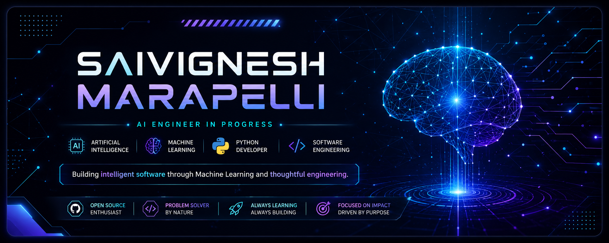

<p align="center">
  
</p>

<h1 align="center">
Marapelli Saivignesh
</h1>

<h3 align="center">
Software Engineer • Artificial Intelligence • Machine Learning
</h3>

<p align="center">

Building intelligent software through Machine Learning,
problem solving, and thoughtful engineering.

</p>

<p align="center">


</p>

---

# 👨‍💻 About Me

I'm a Final Year Computer Science student passionate about building software that solves real-world problems.

My interests lie in Software Engineering, Artificial Intelligence, Machine Learning, and Natural Language Processing. I enjoy transforming ideas into practical applications using Python and continuously improving my skills by building meaningful projects.

Currently, I'm focused on strengthening my software engineering fundamentals while exploring modern AI technologies and open-source development.

---

# ⚡ System Status

```text
━━━━━━━━━━━━━━━━━━━━━━━━━━━━━━━━━━━━━━

STATUS          🟢 Learning

FOCUS           Software Engineering

SPECIALIZATION  Artificial Intelligence

CURRENT STACK   Python • Machine Learning

GOAL            Build impactful software

━━━━━━━━━━━━━━━━━━━━━━━━━━━━━━━━━━━━━━
```

---

# 🎯 Mission 2026

- Master Software Engineering
- Deepen Machine Learning knowledge
- Explore Deep Learning & NLP
- Contribute to Open Source
- Build production-ready AI applications
- Secure a Software Engineer role

---
