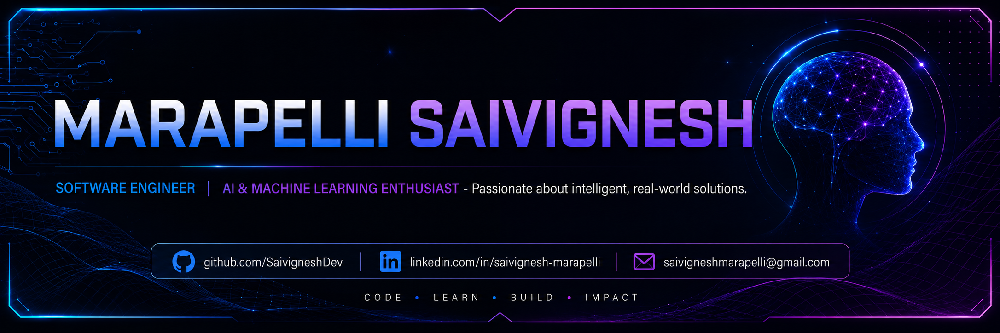

  

<h1 align="center">Hi 👋, I'm Marapelli Saivignesh</h1>

<h3 align="center">
Software Engineer • AI & Machine Learning Enthusiast
</h3>

Building intelligent software that solves real-world problems.

---

# 👨‍💻 About Me

I'm a Final Year Computer Science student passionate about building software that solves real-world problems.

My interests lie in Software Engineering, Artificial Intelligence, Machine Learning, and Natural Language Processing. I enjoy transforming ideas into practical applications using Python and continuously improving my skills by building meaningful projects.

Currently, I'm focused on strengthening my software engineering fundamentals while exploring modern AI technologies and open-source development.

---
## 🚀 Featured Projects

### 🧠 Cross Domain Knowledge Mapping

An AI-powered application that extracts entities and relationships from multiple domains to build an interactive knowledge graph using Natural Language Processing.

**Tech Stack:** Python • SpaCy • Sentence Transformers • NetworkX • Streamlit

🔗 **Repository:** https://github.com/SaivigneshDev/<your-repo-name>

---

### 💰 Employee Salary Prediction

A Machine Learning web application that predicts employee salary categories based on demographic and employment features.

**Tech Stack:** Python • Pandas • NumPy • Scikit-learn • Streamlit

🔗 **Repository:** https://github.com/SaivigneshDev/<your-repo-name>

---

### 🚀 Coming Soon

Building more software engineering and AI projects.

---

## 💻 Tech Stack

### Languages

  

### AI / Machine Learning

  
  
  
  

### Backend & Database

  

### Tools & Platforms

  

---

## 📊 GitHub Analytics

  
  

  

---

## 📈 Contribution Graph

  

---

## 👀 Profile Views

  

---

## 🏆 GitHub Trophies

  

---

## 🐍 Contribution Snake

  

---

## 🌱 Currently Learning

- Backend Development
- Deep Learning
- Data Structures & Algorithms
- Software Engineering Best Practices
  
---

## 📜 Certifications

- 🎓 Infosys Springboard
- 🎓 Coursera
  
---

## 🤝 Connect With Me

- 💼 LinkedIn: https://linkedin.com/in/saivignesh-marapelli
- 📧 Email: saivigneshmarapelli@gmail.com
- 💻 GitHub: https://github.com/SaivigneshDev
  
---

# 🤝 Connect With Me

---

### Code with Curiosity • Build with Purpose • Never Stop Learning

⭐ Thank you for visiting my profile!

